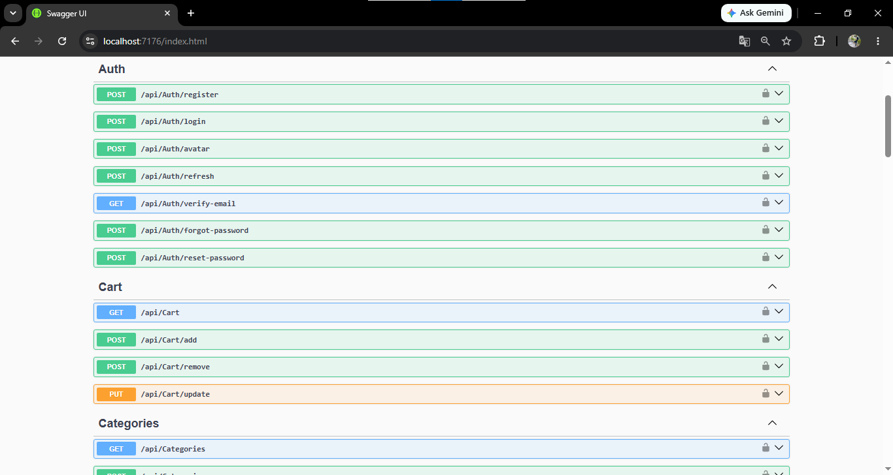
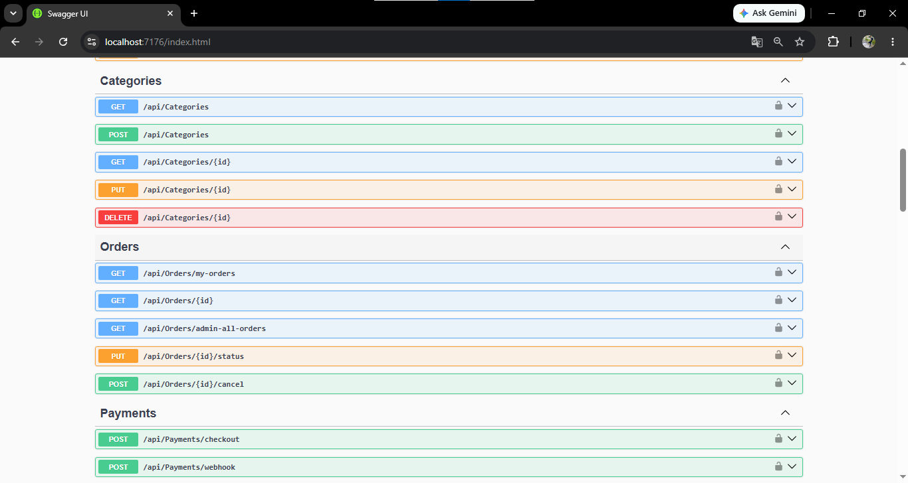
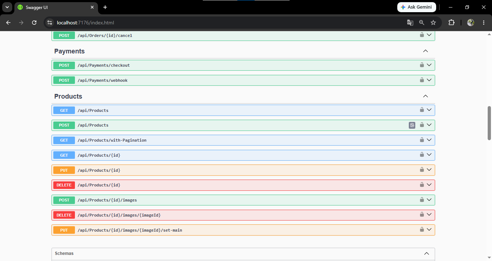
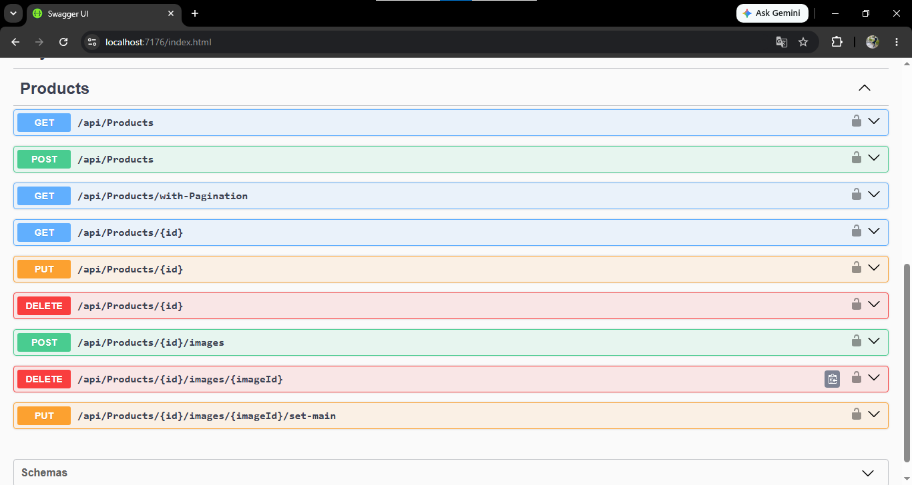
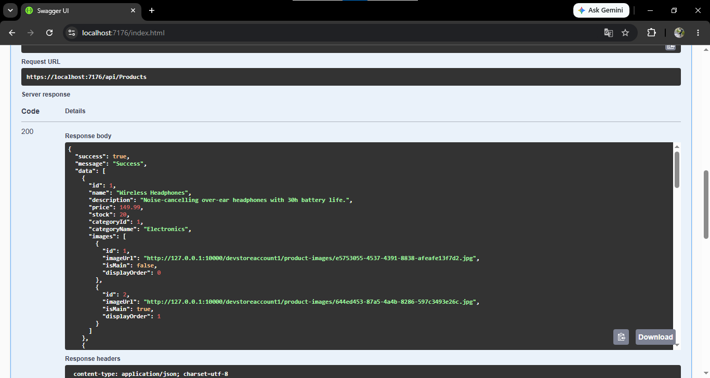
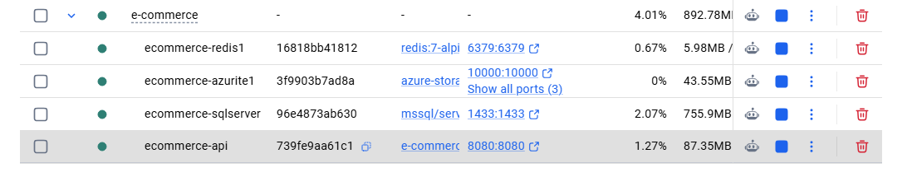

# E-Commerce API

## Description
A Clean Architecture ASP.NET Core Web API for a modern e-commerce backend, including authentication, product catalog, cart, order management, payments, file uploads, and rate limiting.

## Features
- ✔ JWT authentication with refresh tokens
- ✔ Role-based authorization for admin operations
- ✔ Repository + Unit of Work
- ✔ Product catalog and paginated product browsing
- ✔ Cart management with quantity updates and removal
- ✔ Order placement with Stripe checkout integration
- ✔ Payment webhook handling and order cleanup
- ✔ File upload support for product images and user avatars
- ✔ Redis cache for frequently accessed data
- ✔ Global exception handling and structured API responses
- ✔ Rate limiting policies for auth, catalog, and checkout endpoints
- ✔ CQRS with MediatR, validation with FluentValidation, and AutoMapper mappings
- ✔ Clean Architecture
- ✔ Azure Blob Storage
- ✔ Docker Support
- ✔ Swagger
- ✔ Serilog Logging

## Technologies Used
- .NET 9 / ASP.NET Core
- Entity Framework Core
- SQL Server (Docker or LocalDB)
- Docker & Docker Compose
- MediatR
- AutoMapper
- FluentValidation
- Serilog
- Redis
- Stripe
- SendGrid
- Azure Blob Storage SDK

## Architecture
This project follows a Clean Architecture pattern with separate layers:
- `E-Commerce.API` for the web API and request pipeline
- `E-Commerce.Application` for commands, queries, services, DTOs, validation, and MediatR handlers
- `E-Commerce.Domain` for entities, enums, and domain models
- `E-Commerce.Infrastructure` for EF Core, repositories, persistence, identity, and external services

## Folder Structure
- `E-Commerce.API` - API controllers, middleware, startup/Program
- `E-Commerce.Application` - application services, features, DTOs, validators, mappings
- `E-Commerce.Domain` - entity definitions and domain types
- `E-Commerce.Infrastructure` - data access, EF Core DbContext, repositories, services
- `ECommerce.Application.UnitTests` - application layer unit tests

## Database
- Uses EF Core migrations under `E-Commerce.Infrastructure/Migrations`
- Identity tables are configured for `User` and role management
- Product, category, cart, order, payment, refresh token, and image entities are modeled

## Project Highlights

- Clean Architecture
- Repository Pattern
- Unit of Work
- JWT + Refresh Tokens
- Redis Cache
- Stripe Integration
- Azure Blob Storage
- Docker Compose
- Role-Based Authorization
- Global Error Handling
- CQRS with MediatR

### Architecture

### Architecture

```mermaid
graph TD
    %% Styling
    classDef client fill:#f9f9f9,stroke:#333,stroke-width:2px;
    classDef api fill:#007acc,stroke:#005999,stroke-width:2px,color:#fff;
    classDef app fill:#512bd4,stroke:#3b1e9e,stroke-width:2px,color:#fff;
    classDef infra fill:#2d3748,stroke:#1a202c,stroke-width:2px,color:#fff;
    classDef db fill:#e2e8f0,stroke:#4a5568,stroke-width:2px,color:#000;

    %% Nodes
    Client["📱 Client (Web / Mobile / SPA)"]:::client
    
    subgraph Presentation_Layer ["🌐 Presentation Layer (E-Commerce.API)"]
        API["ASP.NET Core 9 Web API • Controllers • Authentication • Authorization • Middleware • Rate Limiting • Swagger"]:::api
    end

    subgraph Application_Layer ["⚙️ Application Layer (E-Commerce.Application)"]
        APP["Application Core (CQRS) • Commands & Queries (MediatR) • DTOs • FluentValidation • AutoMapper • Business Logic"]:::app
    end

    subgraph Infrastructure_Layer ["🏗️ Infrastructure Layer (E-Commerce.Infrastructure)"]
        INFRA["External Services & Data Access • EF Core • Identity • Repositories • Email • Cache • Payment • Azure Blob"]:::infra
    end

    %% Databases
    SQL[("💾 SQL Server")]:::db
    Redis[("⚡ Redis")]:::db
    Stripe[("💳 Stripe")]:::db
    Azure[("☁️ Azure Storage")]:::db

    %% Links
    Client --> API
    API --> APP
    APP --> INFRA
    INFRA --> SQL
    INFRA --> Redis
    INFRA --> Stripe
    INFRA --> Azure
   ```

## Screenshots
### Swagger






### Docker Containers




## Getting Started
### Prerequisites
- .NET 9 SDK
- SQL Server or LocalDB
- Redis
- Visual Studio / VS Code

### Installation
1. Clone the repository
   ```bash
   git clone https://github.com/Hassan1520/E-Commerce-API.git
   cd E-Commerce
   ```
2. Restore packages
   ```bash
   dotnet restore
   ```

### Configuration
1. Copy `E-Commerce.API/appsettings.json` and replace placeholders with your own secrets and connection strings.
2. Use environment variables or user secrets to keep production values secure.

### Run Project
```bash
cd E-Commerce.API
dotnet run
```
## Running with Docker

```bash
docker compose up --build
```

API:
http://localhost:8080/swagger

Open Swagger at `https://localhost:5001/swagger` or the configured URL.

### Database Migration
```bash
cd E-Commerce.Infrastructure
dotnet ef database update --project ../E-Commerce.Infrastructure/E-Commerce.Infrastructure.csproj --startup-project ../E-Commerce.API/E-Commerce.API.csproj
```

### API Documentation (Swagger)
Swagger is enabled by default in development and available at the root URL.

## Authentication
- Register and login endpoints issue JWT tokens
- Refresh tokens are supported via the refresh endpoint
- Admin-only endpoints require the `Admin` role

## Environment Variables
Use environment variables for:
- `JwtSettings:Secret`
- `ConnectionStrings:DefaultConnection`
- `ConnectionStrings:HangfireConnection`
- `ConnectionStrings:Redis`
- `StripeSettings:SecretKey`
- `StripeSettings:PublishableKey`
- `StripeSettings:WebhookSecret`
- `SendGridSettings:ApiKey`
- `AzureStorageSettings:ConnectionString`

## Example API Requests
Use Swagger UI for request examples, or send requests with Postman/cURL.

## Future Improvements
- Add API versioning
- Add end-to-end and integration tests
- Add improved pagination/filtering for catalog and orders
- Move secrets fully to environment variables or Azure Key Vault
- Harden security headers and CORS for production

## Author
 Eng Hassan Hossam

## License
- This project is licensed under the MIT License.
- Developed by Eng Hassan Hossam
